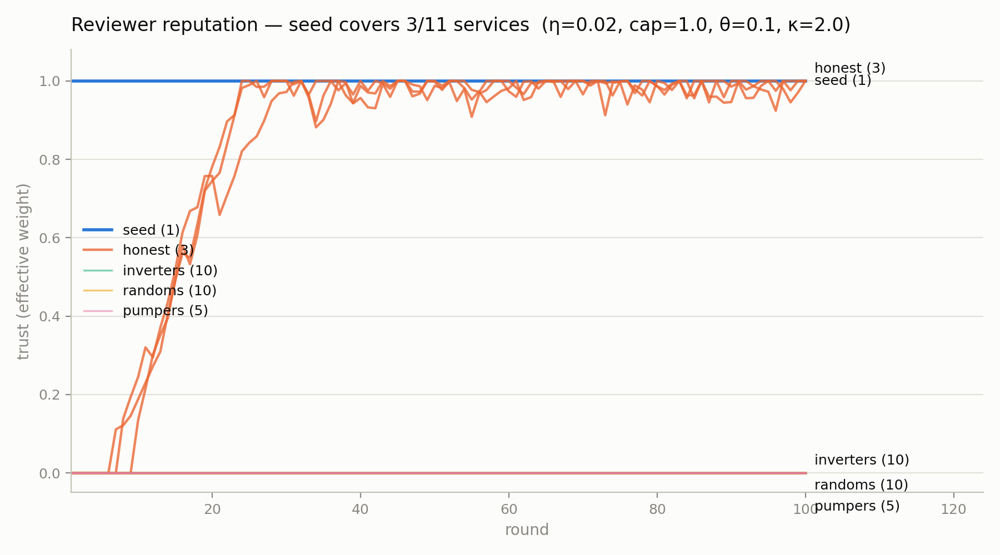
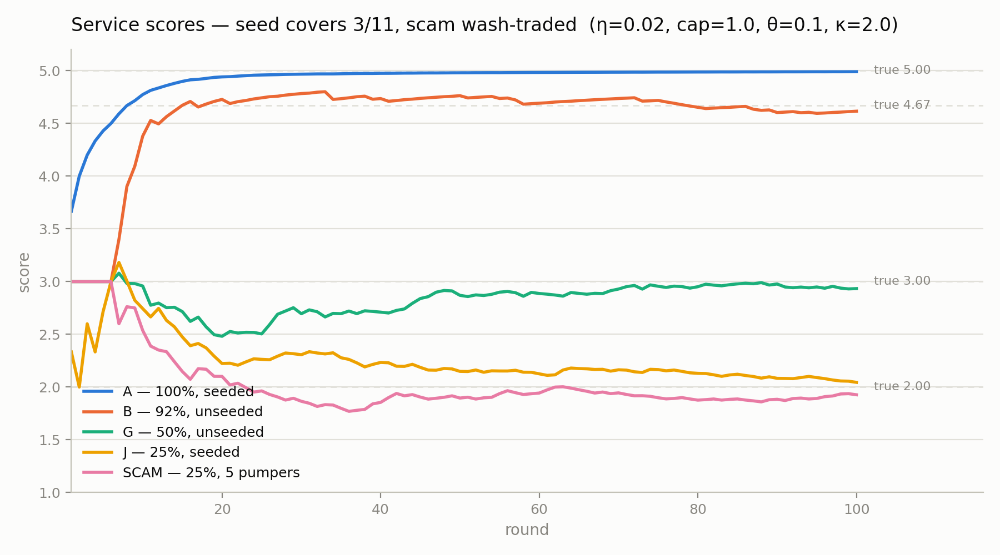

# CrowdCode Scoring & Reputation — Design Doc (v1)

Status: **accepted design, not yet implemented**
Date: 2026-07-26
Simulation evidence: `docs/scoring/sim_scoring3.py` (deterministic, seed=42)

---

## 1. North star

> **The published score of a resource is our best prediction of the rating the
> next honest, trusted reviewer will give it.**

This makes the score a forecast with a measurable loss: every incoming review
from a trusted wallet is a held-out label, and the score published just before
it is the prediction. Mean absolute/squared error over those pairs is the
system's public accuracy metric. All parameters below are tunable against that
backtest — accuracy is a number we report, not a claim we make.

## 2. Scope and principles

- **One canonical score.** A single scoring function serves the MCP tools and
  the website. (Today the MCP returns `weighted_rating` with no prior while the
  site ranks on `rank_score` with a hardcoded 4.0/weight-5 prior — both are
  replaced by this spec.)
- **Reviews are not payment-gated.** Anyone can review any resource — paid
  x402/mppx APIs, npm packages, MCP servers, links — by signing with a wallet.
  Payment is evidence, not admission: it collateralizes the *reviewer*, and a
  verified payment upweights the review.
- **Influence must be earned; bad actors round to zero.** Free identities get
  zero weight by default. Any nonzero default weight × unlimited free wallets
  = unbounded attack (confirmed in simulation, §6.2). Trust flows only from
  seed wallets outward.
- **Public algorithm.** Security is economic, not obscurity-based: influence is
  proportional to irrecoverable cost (accurate track record over time, verified
  external spend), so publishing the algorithm does not weaken it.

## 3. The algorithm

### 3.1 Score (per resource)

```
score(s) = ( Σᵢ wᵢ·rᵢ + κ·μ₀ ) / ( Σᵢ wᵢ + κ )
```

- `rᵢ` — rating (1–5) of review i on resource s
- `wᵢ` — weight of review i (below)
- `κ = 2` — prior strength in pseudo-reviews
- `μ₀` — prior mean; start at 3.0, re-fit from the payment-verified global mean
  per resource type (npm packages, paid APIs, MCP servers have different
  empirical distributions)

Published alongside the score: `n_eff = Σᵢ wᵢ`. A resource with `n_eff ≈ 0`
must display as **unproven at the prior**, never as a starred rating.

### 3.2 Review weight

```
wᵢ = weight(wallet) × proof(i) × decay(Δtᵢ)
```

- `proof(i)` — 2 if the review is backed by a verified on-chain payment
  (correct payee, pinned token, amount ≥ challenge price, payer == reviewer);
  1 for a signed review with no payment proof. Placeholder-verified providers
  (currently anything non-x402/mppx) count as no proof. *(The 2× is a starting
  value; re-fit via backtest.)*
- `decay(Δt)` — half-life 180 days. For versioned resources (npm), additionally
  decay by version distance.

### 3.3 Reviewer trust (the reputation system)

Each wallet has a **raw trust** `t ∈ [−5, 1.0]`. Seeds are pinned at 1.0.
Everyone else starts at 0.

**Effective weight (with the zero-round-down):**

```
weight(w) = raw(w)   if raw(w) ≥ θ      (θ = 0.1)
          = 0        otherwise
cap: raw is clamped above at 1.0
```

**Update rule (proper scoring rule / information content).** On each review
ingest, compute the resource's **leave-one-out score** `LOO` — the score with
this wallet's own reviews excluded. The current consensus implies a success
probability:

```
p = clamp( (LOO − 1) / 4 , 0.05, 0.95 )
likelihood = p        if rating ≥ 4     (the review "predicted success")
           = 1 − p    if rating ≤ 2     (the review "predicted failure")
           = —        ratings of 3 give no trust update
Δraw = η · log₂( likelihood / 0.5 )     (η = 0.02)
```

**Slashing.** Provable fraud — invalid or reused payment proof, worthless-token
payment, funding-graph linkage between reviewer and the resource's payee (wash
trading) — sets raw trust to the floor permanently and removes the wallet's
reviews from all scores retroactively.

### 3.4 Admissibility (hard gates, before any math)

1. Valid EIP-191 signature by `reviewer_wallet` over the canonical payload.
2. Rate limit: 1 review per (wallet, resource) per day. *(This is the only
   volume cap — deliberately. Weight, not volume, is the defense.)*
3. `payment_reference` unique (no proof replay).
4. If a payment proof is present it must fully verify (receipt status 1,
   Transfer `from` == reviewer, `to` == payment_target_ref, **token pinned to
   USDC**, **amount ≥ the 402 challenge price**, tx recent) — else the review
   is admitted as proof=1, never as a half-verified tier.

### 3.5 Seeds

Initial seed set: the operator's own wallets (the wallets on this machine),
pinned at trust 1.0, stored in a `seed_wallets` table. Seeds do **not** need to
review every resource — trust propagates (§6.3). Over time the seed set can
grow to include long-lived, high-accuracy wallets (with hysteresis); that is a
governance decision, not an algorithm change.

## 4. Why these mechanics (the math, briefly)

- **Bayesian shrinkage (κ, μ₀)** — with few reviews the score stays near the
  prior instead of overreacting; `n_eff` makes sparsity visible. Standard
  Beta/Dirichlet-posterior behavior.
- **Log-likelihood trust update** — a *proper scoring rule*. A review earns
  trust exactly in proportion to the information it carried beyond the current
  consensus: echoing a score everyone already agrees on earns ~0 (kills
  copy-the-consensus farming); being confidently right where consensus was
  uncertain earns the most; being wrong costs more than being right pays
  (log asymmetry). In expectation: honest > 0, random = 0 (< 0 off-center),
  adversarial < 0. This replaced a ±1-star "corroboration band," which failed
  in simulation because honest works/doesn't-work ratings are bimodal (§6.1).
- **Leave-one-out consensus** — you cannot earn trust from agreement with a
  consensus your own reviews created. Closes the self-corroboration loop where
  a trusted wallet farms trust on a resource only it reviews.
- **Zero-weight threshold θ** — the "round bad actors down to zero" mechanism.
  Down-weighting is insufficient: n wallets × ε residual weight = n·ε influence.
  Confirmed in simulation: without the threshold, 20 adversaries at mean
  residual trust ≈ 0.05 aggregated ~1.0 weight and dragged MAE from 0.36 to
  0.45; with it, their weight is exactly 0 and MAE fell to 0.06.
- **No reflecting floor at zero for raw trust** — with a floor at 0, a
  coin-flipping wallet random-walks off the wall and drifts upward (one reached
  0.31 in simulation). Letting raw trust go to −5 means a random or adversarial
  wallet sinks and would need ~50 consecutive correct calls to ever cross θ.
- **Seed anchoring (EigenTrust structure)** — trust updates are zero while a
  resource's consensus sits at the prior (p = 0.5 ⇒ log₂1 = 0), and
  zero-weight wallets cannot move a consensus. Therefore trust can only *begin*
  to be earned on resources whose scores were moved by already-weighted wallets
  — trust mass flows outward from the seeds, exactly the EigenTrust
  `t = (1−α)Cᵀt + α·p` seed-vector property, obtained here without computing an
  eigenvector. The v1 rule is the first power-iteration step; iterating to the
  fixed point is a drop-in v2 upgrade of the same batch job.

## 5. Chosen parameters

| Param | Value | Meaning | How chosen |
|---|---|---|---|
| κ | 2 | prior pseudo-reviews | sweep (§6.4) |
| μ₀ | 3.0 → fit | prior mean, per resource type | backtest |
| η | 0.02 | trust learning rate | sweep — larger values caused honest-wallet flicker and let random walkers transiently cross θ |
| cap | 1.0 | max non-seed raw trust | sweep — the wide cap→θ gap keeps honest wallets far from the zero-weight cliff |
| θ | 0.1 | zero-weight threshold | sweep |
| raw floor | −5 | trust debt ceiling | prevents reflected drift; bounds recovery time |
| p clamp | [0.05, 0.95] | likelihood bounds | bounds any single update to ≈ ±3.3·η |
| proof multiplier | 2× | payment-verified upweight | starting value; re-fit via backtest |
| decay half-life | 180 d | review staleness | starting value; re-fit via backtest |

All constants are calibrated on simulated works/doesn't-work reviewers; real
ratings (2s/3s/4s, subjective quality) are noisier. The structure is validated;
re-fit the constants against the production backtest (§8.4).

## 6. Simulation evidence

Deterministic (seed=42), 100 rounds; each round every reviewer reviews each of
their services once (matching the 1/day rate limit). Honest behavior: 5 stars
if the call worked, 1 if it failed. True quality of a service with reliability
p is the expected honest rating `1 + 4p`. Reproduce with
`python docs/scoring/sim_scoring3.py`.

### 6.1 v1 candidate rules that failed (5 services, 4 reviewers)

| Trust rule | honest | inverter | random | score MAE |
|---|---|---|---|---|
| +0.1 if within ±1 of consensus, no penalty | 0.50 | 0.10 | **0.50** | 0.36 |
| same, with −0.1 penalty | **0.10** | 0.10 | 0.00 | 0.17 |
| sign-agreement ±0.1 | 0.30 | 0.10 | **0.20** | 0.26 |

Failures: without a penalty, a coin-flip wallet maxes out trust; with the ±1
band penalty, honest wallets get destroyed on mid-reliability services (their
1s and 5s are both >1 from a ~3.3 score — the band assumes unimodal ratings);
sign-agreement + a floor at 0 turns a fair coin into upward drift.

### 6.2 Log-likelihood rule under adversarial majority (20 adversaries vs 2 honest)

Trust separated perfectly (honest 0.50, inverters ~0.02, randoms ~0.08) — but
score MAE **worsened** to 0.45: twenty small residual trusts summed to ~1.0
aggregate weight. Adding θ (zero below 0.1) and removing the floor-at-zero:
every adversary at exactly 0 weight, **MAE 0.06**.

### 6.3 Full v3 scenario — partial seed coverage + wash-trading attack

1 seed reviewing only **3 of 11** services · 3 honest reviewing everything ·
10 inverters · 10 randoms · 5 pumpers posting only 5-star reviews on their own
25%-reliable scam service (500 wash reviews total).




Results (best config η=0.02, cap=1.0, θ=0.1, κ=2):

- **MAE 0.06 across all 11 services; zero honest flicker; every adversary at
  exactly zero weight in every round.**
- **Trust propagated beyond the seed.** Honest wallets earned trust on the 3
  seeded services (crossing θ around rounds 10–25), then anchored accurate
  consensus on the 8 services the seed never touched (e.g. unseeded 92% service:
  4.62 vs true 4.67).
- **The wash-trade attack scored 1.93 (true 2.00).** The pumpers reviewed
  nothing the trusted population covers, so their LOO consensus never left the
  prior, their trust updates were exactly zero, and their 500 five-star reviews
  carried zero weight.

### 6.4 Parameter sweep (24 configs)

η ∈ {0.02, 0.05, 0.1} × cap ∈ {0.5, 1.0} × θ ∈ {0.1, 0.2} × κ ∈ {2, 5}.
Every config achieved MAE ≤ 0.08 and contained the scam service — the design is
robust to these parameters. η=0.1 configs showed honest flicker (up to 12
zero-weight rounds) and transient adversary weight (up to 0.50); all η=0.02
configs showed neither. Selection rule: zero flicker, zero adversary weight,
then min MAE.

## 7. Attack analysis

| Attack | Cost to attacker | Outcome |
|---|---|---|
| Sybil flood (n fresh wallets, free reviews) | ~0 | ~0 — wallets never cross θ; resource sits at prior with n_eff ≈ 0, displayed "unproven" (§6.3) |
| Wash-trade own resource | gas/fees | 0 weight — LOO keeps their consensus at prior; no trust ever earned (§6.3) |
| Earn-then-pump (review honestly elsewhere, then pump own resource) | weeks of honest reviewing per wallet | bounded: one trusted wallet moves a lonely resource ≈ prior→3.7 at 1 review/day; LOO blocks trust gain from it; the first honest trusted review starts both correcting the score and (in the v2 batch re-evaluation) slashing the pumper's trust |
| Nuke a competitor | trust burned per wrong review | log-penalty ≈ 3.5× the honest gain per review; a trusted wallet self-slashes below θ within a handful of contradicted reviews |
| Consensus echo (farm trust by copying scores) | time | ~0 gain — proper scoring rule pays only for information beyond the prior |
| Whitewash (rotate resource identity) | redeploy | restart at prior with n_eff = 0; spend policies should prefer proven resources |

Residual risks, accepted for v1: (a) an earn-then-pump attacker gets a
temporary partial lift on an otherwise-unreviewed resource — mitigated by n_eff
display and shrunk further by clustering in v2; (b) trust is not yet
re-evaluated retroactively when consensus later shifts — the nightly sweep and
the v2 fixed-point iteration address this; (c) a colluding cluster that first
earns trust honestly across many wallets — v2 clustering (funding lineage,
co-spend, timing) caps per-cluster weight per resource.

## 8. Architecture

### 8.1 Dynamic, not cron (for scoring)

The v1 trust rule is *local*: a new review affects only the reviewer's trust
and that one resource's score. Both are recomputed on the **write path** at
review ingest, in one transaction:

1. Admissibility gates (§3.4); reject or admit.
2. Compute the resource's LOO score for this wallet; apply the trust update to
   `users.raw_trust`.
3. Recompute and store the resource's score row (`score`, `n_eff`).

Reads apply time decay at query time (or read the stored row; staleness from
decay alone is bounded and corrected by the sweep). All reads — MCP
`get_service_score`, `/api/services`, `/api/services/top` — go through **one**
canonical scoring function (natural home: `src/crowdcode/scoring.py`, currently
a stub).

### 8.2 Cron (Render Cron Job service, one entrypoint, dependency order)

1. **Nightly consistency sweep** — recompute all trust and scores from scratch;
   alert on drift vs the incremental values. This also catches the trust
   ripple: new reviews can flip whether *old* reviews were corroborated, which
   the write path deliberately does not chase. (This job is where the v2
   EigenTrust fixed-point iteration will live — same job, looped to
   convergence.)
2. **Per-resource review summaries** (LLM) — only for resources with reviews
   newer than `last_summarized_at`; summarizer input is trust-weighted (wallets
   below θ don't get to write the narrative); output is a constrained
   factual format (strengths / failure modes / caveats) treating review text
   as untrusted data; passes egress redaction; served inside
   `get_service_score` and on the site next to the raw rating histogram,
   labeled "AI-generated from N reviews through <date>".
3. **Requested-services summary** (LLM) — same watermark pattern.

### 8.3 Schema changes

- `wallet_users` table: `user_id`, `wallet_address` (unique), `created_at`,
  `is_seed`, `raw_trust`, `trust_updated_at`, `slashed_at`. Reviews FK to it.
  The existing salted `reviewer_id` remains the public/egress identifier.
  (Named `wallet_users`, not `users`: the database already carries an
  unrelated `public.users` table from another app.)
- `wallet_users.is_seed`: operator wallets pinned at 1.0, synced from
  `CROWDCODE_SEED_WALLETS`.
- `reviews.amount` extracted from `payment_proof` **after** the token-pinning
  and amount-validation fixes land (the JSONB value is untrusted today).
- `services`: `resource_type`, `score`, `n_eff`, `score_updated_at`,
  `last_summarized_at`; verify `created_at` exists on `services` and
  `service_requests`.

### 8.4 Backtest (the accuracy metric)

Replay all reviews in time order; for each review by a wallet whose weight is
above θ at that moment, record `|published_score_before − rating|`. Report the
rolling aggregate publicly ("our score predicts the next trusted review within
±X stars"). Re-fit μ₀, κ, η, proof multiplier, and decay half-life against it
periodically. Version the algorithm (this doc = v1); scores are recomputable by
third parties from public signed reviews and on-chain payments.

## 9. v2 roadmap (deferred, deliberately)

1. **Full EigenTrust fixed point** — iterate the trust update over the whole
   graph to convergence in the nightly job; write path unchanged. Needed once
   enough non-seed wallets hold trust that *their* corroboration of third
   parties should compound, and it retroactively re-scores old reviews against
   shifted consensus (slashing earn-then-pump attackers).
2. **Wallet clustering** — funding lineage, co-spend, temporal correlation;
   per-cluster weight cap per resource; cluster-wide slashing.
3. **Per-type priors and proof signals** — fit μ₀/κ per resource type; richer
   proof-of-use tiers where honestly verifiable.
4. **Graded ratings model** — the works/failed Bernoulli likelihood generalizes
   to an ordinal model over 1–5 once real rating distributions are observed.
