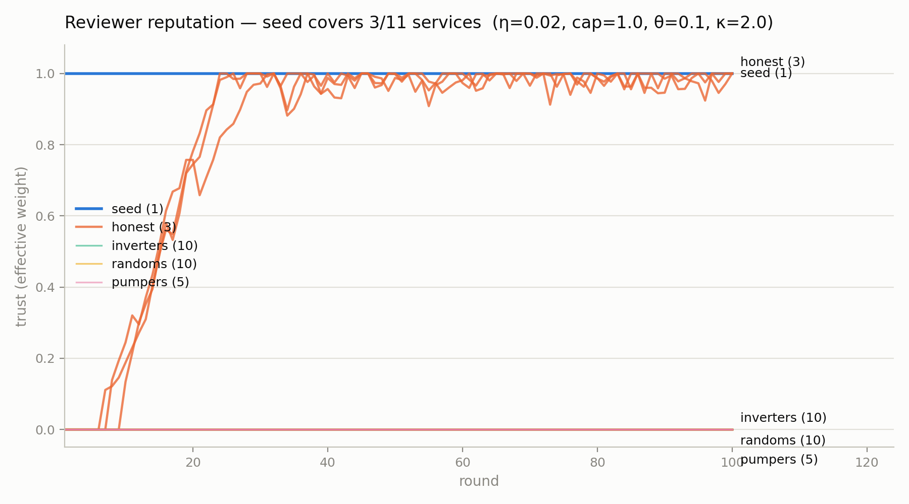
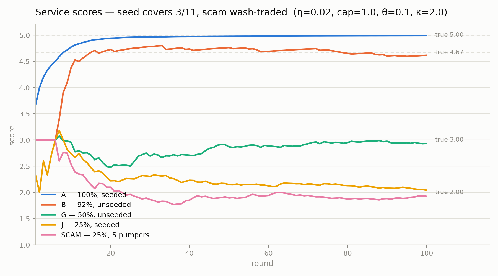

# CrowdCode Scoring & Reputation — Design Doc (v2)

Status: **implemented (`crowdcode-scoring-v2`); deployment requires a score replay**
Updated: 2026-09-29
Regression simulation: `tests/test_scoring_sim.py` (deterministic, seed=42).
The figures and sweep results in §6 are historical v1 evidence from
`docs/scoring/sim_scoring3.py`, using a public prior of 3.0.

V2 changes the public service prior from 3.0 to **4.0**, retaining strength 2.
Reputation's internal leave-one-out consensus retains the **3.0** prior, so
wallet trust and seed requirements remain unchanged. A higher public default
must not create reputation evidence for wallets that have earned no trust.

For deployment, pause backend review writes and the cron, apply
`supabase/scoring-v2.sql`, deploy v2 to both, and run
`crowdcode.cron.run_consistency_sweep(utc_now())` before resuming service.
The replay refreshes every stored score from review history, including empty
services; changing the schema default alone does not refresh existing scores.

---

## 1. North star

> **The published score of a resource is our best prediction of the rating the
> next honest, trusted reviewer will give it.**

This makes the score a forecast with a measurable loss: every incoming review
from a trusted wallet is a held-out label, and the score published just before
it is the prediction. Mean absolute/squared error over those pairs is the
system's public accuracy metric. All parameters below are tunable against that
backtest — accuracy is a number we report, not a claim we make.

## 2. Scope and principles

- **One canonical public score.** A single scoring function serves the MCP tools
  and the website. `weighted_rating` and `rank_score` are aliases of `score`.
  The internal reputation consensus uses the same math with a neutral prior.
- **Payment evidence is optional.** Unpaid reviews require an authenticated
  wallet signature and use the existing `signature_only` multiplier. When an
  x402/mppx payment is claimed, CrowdCode must verify the transaction on its
  supported chain; invalid supplied claims are rejected, never downgraded.
  All experiences share one score and wallet/service/UTC-day influence cap.
- **Influence must be earned; bad actors round to zero.** Free identities get
  zero weight by default. Any nonzero default weight × unlimited free wallets
  = unbounded attack (confirmed in simulation, §6.2). Trust flows only from
  seed wallets outward.
- **Public algorithm.** Security is economic, not obscurity-based: influence is
  proportional to irrecoverable cost (accurate track record over time, verified
  external spend), so publishing the algorithm does not weaken it.

## 3. The algorithm

### 3.1 Score (per resource)

```
score(s) = ( Σᵢ wᵢ·rᵢ + κ·μ₀ ) / ( Σᵢ wᵢ + κ )
```

- `rᵢ` — rating (1–5) of review i on resource s
- `wᵢ` — weight of review i (below)
- `κ = 2` — prior strength in pseudo-reviews
- `μ₀ = 4.0` — public prior mean. It is fixed, not automatically fitted.

Published alongside the score: `n_eff = Σᵢ wᵢ`. A resource with `n_eff ≈ 0`
must display as **unproven at the prior**, never as a starred rating.

The index `i` is a wallet/service/UTC-calendar-day bucket, not an individual
call. All unique paid outcomes remain stored. Within a bucket, the rating is
the proof-and-decay-weighted average of its reviews, while the bucket evidence
is capped at the strongest single review. Repeated calls improve that day's
estimate without multiplying one wallet's influence.

### 3.2 Review weight

```
wᵢ = weight(wallet) × proof(i) × decay(Δtᵢ)
```

- `proof(i)` — keyed on the review's `payment_verification_level`:

  | level | multiplier | what it proves |
  |---|---|---|
  | `unverified` | 1 | nothing beyond admission (legacy/placeholder providers) |
  | `signature_only` | 1 | wallet signature over the review; payment not verified |
  | `onchain_verified` | 2 | on-chain ERC-20 transfer, reviewer wallet → service payee, pinned token |
  | `response_attested` | 2 | reserved: signed receipt binding payment to a specific request/response |

  "Verified purchase" means exactly `onchain_verified`: a successful receipt
  with a Transfer of the pinned token from the reviewer's wallet to the
  service payee. It does NOT matter whether the client supplied a
  `payment_proof` header or only the settlement tx hash in
  `payment_reference` — the proof header is unsigned client-supplied JSON,
  so every load-bearing fact comes from the chain either way, and both
  routes earn the same 2×. A proof premium would be security theater;
  `response_attested` is reserved for the day CrowdCode verifies a
  facilitator/server-signed receipt that binds the payment to the specific
  request and response — only then does a stronger tier exist to price.
  *(The 2× is a starting value; re-fit via backtest.)*
- `decay(Δt)` — half-life 180 days. For versioned resources (npm), additionally
  decay by version distance.

### 3.3 Reviewer trust (the reputation system)

Each wallet has a **raw trust** `t ∈ [−5, 1.0]`. Seeds are pinned at 1.0.
Everyone else starts at 0.

**Effective weight (with the zero-round-down):**

```
weight(w) = raw(w)   if raw(w) ≥ θ      (θ = 0.1)
          = 0        otherwise
cap: raw is clamped above at 1.0
```

**Update rule (proper scoring rule / information content).** During the nightly
authoritative replay, process each wallet/service/UTC-day bucket once and
compute the resource's **leave-one-out consensus** `LOO` — the weighted score
with this wallet's own reviews excluded and a **3.0 prior**, strength 2.
This internal consensus is intentionally different from the published score.
The current consensus implies a success probability:

```
p = clamp( (LOO − 1) / 4 , 0.05, 0.95 )
likelihood = p        if rating ≥ 4     (the review "predicted success")
           = 1 − p    if rating ≤ 2     (the review "predicted failure")
           = —        bucket ratings strictly between 2 and 4 give no update
Δraw = η · log₂( likelihood / 0.5 )     (η = 0.02)
```

**Negative trust and slashing.** Raw trust −5 is the maximum accumulated trust
penalty, not a negative review weight. Every value below 0.1 contributes zero.
An unslashed wallet can recover by earning trust; even at the maximum gain
`0.02 × log₂(1.9) ≈ 0.01852`, moving from −5 to 0.1 takes at least 276
positive daily-bucket events. Multiple services can produce events on one day.
A separate `slashed_at` flag forces zero weight even for seeds and prevents
trust updates. Current code honors that flag but does not set it automatically;
invalid payment claims are rejected rather than automatically slashing wallets.

### 3.4 Admissibility (hard gates, before any math)

1. Valid EIP-191 signature by `reviewer_wallet` over the canonical payload.
2. Every unique verified payment may produce a stored review. Scoring and
   trust aggregate all reviews for one wallet/resource/UTC day into one capped
   bucket; there is no review-ingest throttle.
3. `payment_reference` unique on its **canonical form** (provider prefixes
   like `x402:base:` stripped) — the same settlement tx can never yield two
   reviews under different spellings.
4. A **supplied** payment proof must fully verify (receipt status 1, Transfer
   `from` == reviewer, `to` == payment_target_ref, **token pinned** — USDC on
   Base for x402, `MPPX_TEMPO_TOKEN_ADDRESS` on Tempo for mppx — **amount ≥
   the 402 challenge price** when one is stated) — else the review is
   **rejected outright**: a failing proof is worse than no proof and must
   never silently downgrade.
5. When claiming payment with **no proof header**, `payment_reference` must be a transaction hash and
   runs the same on-chain check. Failed transactions, wrong token/payee/payer,
   malformed references, and unsupported chains reject the review and store
   nothing. An unreachable RPC returns a retryable unavailable result, stores
   nothing, and does not reserve the reference.
6. Token pinning is symmetric across both routes. A missing pin is a retryable
   verifier-configuration error and stores nothing.
7. New machine-payment verification supports x402 USDC on Base and mppx on
   Tempo. Solana and all other chains are explicitly unsupported; they never
   fall back to `signature_only` on a failed payment claim. Omitting all payment
   evidence instead admits an authenticated unpaid review at `signature_only`.

### 3.5 Seeds

Initial seed set: the operator's own wallets (the wallets on this machine),
pinned at trust 1.0, stored in `wallet_users.is_seed`. Seeds do **not** need to
review every resource — trust propagates (§6.3). Over time the seed set can
grow to include long-lived, high-accuracy wallets (with hysteresis); that is a
governance decision, not an algorithm change.

Hosted OpenCrowd deployments can install `supabase/opencrowd-wallets.sql`.
Its operator-owned view supplies registered mainnet `agent_eoa` addresses;
those wallets are also pinned at 1.0 on first review, server startup, and cron
seed reconciliation. Explicit seeds are unioned with this registry. Standalone
installations work without the view. Legacy external wallets, test/demo agents,
and unregistered CLI wallets receive no automatic seed status. Deleted hosted
agents keep historical seed identity; `slashed_at` still overrides seed weight.

TODO: Revisit unconditional hosted trust, calibrate reputation against outcomes,
and limit correlated/self-review influence before broadening automatic seeding.

## 4. Why these mechanics (the math, briefly)

- **Bayesian shrinkage (κ, μ₀)** — with few reviews the score stays near the
  prior instead of overreacting; `n_eff` makes sparsity visible. Standard
  Beta/Dirichlet-posterior behavior.
- **Log-likelihood trust update** — a *proper scoring rule*. A review earns
  trust exactly in proportion to the information it carried beyond the current
  consensus: echoing a score everyone already agrees on earns ~0 (kills
  copy-the-consensus farming); being confidently right where consensus was
  uncertain earns the most; being wrong costs more than being right pays
  (log asymmetry). In expectation: honest > 0, random = 0 (< 0 off-center),
  adversarial < 0. This replaced a ±1-star "corroboration band," which failed
  in simulation because honest works/doesn't-work ratings are bimodal (§6.1).
- **Leave-one-out consensus** — you cannot earn trust from agreement with a
  consensus your own reviews created. Closes the self-corroboration loop where
  a trusted wallet farms trust on a resource only it reviews.
- **Zero-weight threshold θ** — the "round bad actors down to zero" mechanism.
  Down-weighting is insufficient: n wallets × ε residual weight = n·ε influence.
  Confirmed in simulation: without the threshold, 20 adversaries at mean
  residual trust ≈ 0.05 aggregated ~1.0 weight and dragged MAE from 0.36 to
  0.45; with it, their weight is exactly 0 and MAE fell to 0.06.
- **No reflecting floor at zero for raw trust** — with a floor at 0, a
  coin-flipping wallet random-walks off the wall and drifts upward (one reached
  0.31 in simulation). Letting raw trust go to −5 means a penalized wallet
  accumulates debt; recovery from the floor takes at least 276 maximally
  rewarded bucket events before crossing θ.
- **Seed anchoring (EigenTrust structure)** — trust updates are zero while a
  resource's internal consensus sits at its 3.0 prior (p = 0.5 ⇒ log₂1 = 0), and
  zero-weight wallets cannot move a consensus. Therefore trust can only *begin*
  to be earned on resources whose scores were moved by already-weighted wallets
  — trust mass flows outward from the seeds, exactly the EigenTrust
  `t = (1−α)Cᵀt + α·p` seed-vector property, obtained here without computing an
  eigenvector. The v1 rule is the first power-iteration step; iterating to the
  fixed point is a drop-in v2 upgrade of the same batch job.

## 5. Chosen parameters

| Param | Value | Meaning | How chosen |
|---|---|---|---|
| κ | 2 | prior pseudo-reviews | sweep (§6.4) |
| μ₀ | 4.0 | public service prior mean | operator choice |
| trust μ₀ | 3.0 | internal reputation consensus prior | preserves v1 trust |
| η | 0.02 | trust learning rate | sweep — larger values caused honest-wallet flicker and let random walkers transiently cross θ |
| cap | 1.0 | max non-seed raw trust | sweep — the wide cap→θ gap keeps honest wallets far from the zero-weight cliff |
| θ | 0.1 | zero-weight threshold | sweep |
| raw floor | −5 | trust debt ceiling | prevents reflected drift; bounds recovery time |
| p clamp | [0.05, 0.95] | likelihood bounds | bounds any single update to ≈ ±3.3·η |
| proof multiplier | 2× | payment-verified upweight | starting value; re-fit via backtest |
| decay half-life | 180 d | review staleness | starting value; re-fit via backtest |

All constants are calibrated on simulated works/doesn't-work reviewers; real
ratings (2s/3s/4s, subjective quality) are noisier. The structure is validated;
re-fit the constants against the production backtest (§8.4).

## 6. Simulation evidence

Deterministic (seed=42), 100 daily rounds; each round every reviewer reviews
each of their services once (matching the UTC-day influence cap). Honest behavior: 5 stars
if the call worked, 1 if it failed. True quality of a service with reliability
p is the expected honest rating `1 + 4p`. Reproduce with
`python docs/scoring/sim_scoring3.py`.

### 6.1 v1 candidate rules that failed (5 services, 4 reviewers)

| Trust rule | honest | inverter | random | score MAE |
|---|---|---|---|---|
| +0.1 if within ±1 of consensus, no penalty | 0.50 | 0.10 | **0.50** | 0.36 |
| same, with −0.1 penalty | **0.10** | 0.10 | 0.00 | 0.17 |
| sign-agreement ±0.1 | 0.30 | 0.10 | **0.20** | 0.26 |

Failures: without a penalty, a coin-flip wallet maxes out trust; with the ±1
band penalty, honest wallets get destroyed on mid-reliability services (their
1s and 5s are both >1 from a ~3.3 score — the band assumes unimodal ratings);
sign-agreement + a floor at 0 turns a fair coin into upward drift.

### 6.2 Log-likelihood rule under adversarial majority (20 adversaries vs 2 honest)

Trust separated perfectly (honest 0.50, inverters ~0.02, randoms ~0.08) — but
score MAE **worsened** to 0.45: twenty small residual trusts summed to ~1.0
aggregate weight. Adding θ (zero below 0.1) and removing the floor-at-zero:
every adversary at exactly 0 weight, **MAE 0.06**.

### 6.3 Full v3 scenario — partial seed coverage + wash-trading attack

1 seed reviewing only **3 of 11** services · 3 honest reviewing everything ·
10 inverters · 10 randoms · 5 pumpers posting only 5-star reviews on their own
25%-reliable scam service (500 wash reviews total).




Results (best config η=0.02, cap=1.0, θ=0.1, κ=2):

- **MAE 0.06 across all 11 services; zero honest flicker; every adversary at
  exactly zero weight in every round.**
- **Trust propagated beyond the seed.** Honest wallets earned trust on the 3
  seeded services (crossing θ around rounds 10–25), then anchored accurate
  consensus on the 8 services the seed never touched (e.g. unseeded 92% service:
  4.62 vs true 4.67).
- **The wash-trade attack scored 1.93 (true 2.00).** The pumpers reviewed
  nothing the trusted population covers, so their LOO consensus never left the
  prior, their trust updates were exactly zero, and their 500 five-star reviews
  carried zero weight.

### 6.4 Parameter sweep (24 configs)

η ∈ {0.02, 0.05, 0.1} × cap ∈ {0.5, 1.0} × θ ∈ {0.1, 0.2} × κ ∈ {2, 5}.
Every config achieved MAE ≤ 0.08 and contained the scam service — the design is
robust to these parameters. η=0.1 configs showed honest flicker (up to 12
zero-weight rounds) and transient adversary weight (up to 0.50); all η=0.02
configs showed neither. Selection rule: zero flicker, zero adversary weight,
then min MAE.

## 7. Attack analysis

| Attack | Cost to attacker | Outcome |
|---|---|---|
| Sybil flood (n fresh wallets, free reviews) | ~0 | ~0 — wallets never cross θ; resource sits at prior with n_eff ≈ 0, displayed "unproven" (§6.3) |
| Wash-trade own resource | gas/fees | 0 weight — LOO keeps their consensus at prior; no trust ever earned (§6.3) |
| Earn-then-pump (review honestly elsewhere, then pump own resource) | weeks of honest reviewing per wallet | bounded: one trusted wallet moves a lonely resource ≈ prior→3.7 per daily bucket; LOO blocks trust gain from it; the first honest trusted review starts both correcting the score and (in the v2 batch re-evaluation) slashing the pumper's trust |
| Nuke a competitor | trust burned per wrong review | log-penalty ≈ 3.5× the honest gain per review; a trusted wallet self-slashes below θ within a handful of contradicted reviews |
| Consensus echo (farm trust by copying scores) | time | ~0 gain — proper scoring rule pays only for information beyond the prior |
| Whitewash (rotate resource identity) | redeploy | restart at prior with n_eff = 0; spend policies should prefer proven resources |

Residual risks, accepted for v1: (a) an earn-then-pump attacker gets a
temporary partial lift on an otherwise-unreviewed resource — mitigated by n_eff
display and shrunk further by clustering in v2; (b) trust is not yet
re-evaluated retroactively when consensus later shifts — the nightly sweep and
the v2 fixed-point iteration address this; (c) a colluding cluster that first
earns trust honestly across many wallets — v2 clustering (funding lineage,
co-spend, timing) caps per-cluster weight per resource.

## 8. Architecture

### 8.1 Review write path

The write path validates and stores each unique paid outcome, then refreshes
the affected resource's score using current trust in one transaction:

1. Admissibility gates (§3.4); reject or admit.
2. Store the review and its verified payment metadata.
3. Recompute and store the resource's score (`score`, `n_eff`), with daily
   bucket aggregation applied by the canonical scoring function.

Reads apply time decay at query time (or read the stored row; staleness from
decay alone is bounded and corrected by the sweep). All reads — MCP
`get_service_score`, `/api/services`, `/api/services/top` — go through **one**
canonical scoring function in `src/crowdcode/scoring.py`.

### 8.2 Cron (Render Cron Job service, one entrypoint, dependency order)

1. **Nightly consistency sweep** — replay one wallet/resource/UTC-day bucket
   at a time, recompute trust and scores from scratch, and alert on drift. Trust
   updates happen only here, so bursts of paid calls cannot multiply either
   score or reputation influence. This job is also where a future EigenTrust
   fixed-point iteration can live.
2. **Per-resource review summaries** (LLM) — only for resources with reviews
   newer than `last_summarized_at`; summarizer input is trust-weighted (wallets
   below θ do not contribute when trusted reviews exist). Cold-start summaries
   include authenticated unpaid reviews as well as verified payments, with the
   payment status retained. Output is a constrained
   factual format (strengths / failure modes / caveats) treating review text
   as untrusted data; passes egress redaction; served inside
   `get_service_score` and on the site next to the raw rating histogram,
   labeled "AI-generated from N reviews through <date>".
3. **Requested-services summary** (LLM) — same watermark pattern.

### 8.3 Schema changes

- `wallet_users` table: `user_id`, `wallet_address` (unique), `created_at`,
  `is_seed`, `raw_trust`, `trust_updated_at`, `slashed_at`. Reviews FK to it.
  The existing salted `reviewer_id` remains the public/egress identifier.
  (Named `wallet_users`, not `users`: the database already carries an
  unrelated `public.users` table from another app.)
- `wallet_users.is_seed`: operator wallets pinned at 1.0, synced from
  `CROWDCODE_SEED_WALLETS`.
- `reviews.amount` extracted from `payment_proof` **after** the token-pinning
  and amount-validation checks pass.
- `reviews(service_id, reviewer_wallet, created_at)` B-tree index supports the
  daily bucket access path; existing review RLS remains default-deny.
- `services`: `resource_type`, `score`, `n_eff`, `score_updated_at`,
  `last_summarized_at`; verify `created_at` exists on `services` and
  `service_requests`.

### 8.4 Backtest (the accuracy metric)

Replay all reviews in time order; for each review by a wallet whose weight is
above θ at that moment, record `|published_score_before − rating|`. Report the
rolling aggregate publicly ("our score predicts the next trusted review within
±X stars"). Re-fit μ₀, κ, η, proof multiplier, and decay half-life against it
periodically. Version the algorithm (this doc = v1); scores are recomputable by
third parties from public signed reviews and on-chain payments.

## 9. v2 roadmap (deferred, deliberately)

1. **Full EigenTrust fixed point** — iterate the trust update over the whole
   graph to convergence in the nightly job. Needed once
   enough non-seed wallets hold trust that *their* corroboration of third
   parties should compound, and it retroactively re-scores old reviews against
   shifted consensus (slashing earn-then-pump attackers).
2. **Wallet clustering** — funding lineage, co-spend, temporal correlation;
   per-cluster weight cap per resource; cluster-wide slashing.
3. **Per-type priors and proof signals** — fit μ₀/κ per resource type; richer
   proof-of-use tiers where honestly verifiable.
4. **Graded ratings model** — the works/failed Bernoulli likelihood generalizes
   to an ordinal model over 1–5 once real rating distributions are observed.
