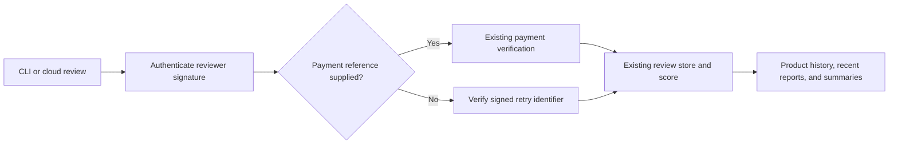

# Optional payment evidence on reviews

One `review_service` tool stores paid and unpaid experiences in the same review
table, history, summaries, and score. Payment is evidence, not an admission
requirement. This change adds no zkTLS proof or AI-authorship claim.

## Submission

For an unpaid experience, send `rating`, `reason`, a service ID or endpoint,
and a stable `review_nonce` matching `[A-Za-z0-9_-]{8,128}`. Omit
`payment_reference`, `payment_proof`, and `payment_challenge`. The local MCP
client generates a nonce when absent and returns it for subsequent retries.
OpenCrowd persists its interaction ID before review submission and reuses that
ID as the nonce, including after a restart.

The reviewer still signs an EIP-191 message. This does not make a payment or
require wallet funds. Direct backend callers supply `reviewer_wallet` and
`review_signature`; the MCP client and hosted gateway sign automatically.
See the [canonical signing contract](../spec/CANONICAL_PAYLOAD.md): existing
paid v1 messages are unchanged; unpaid v2 messages bind the nonce and explicitly
set the payment reference to null.

An accepted unpaid review returns `payment_verified: false`,
`verified_purchase: false`, `signature_verified: true`, and the existing
`payment_verification_level: signature_only`. A signature proves who submitted
the review, not that an endpoint was called or that the review is correct.

Payment references remain unique. Supplied x402/mppx claims still require the
existing payer, payee, token, and chain checks. Invalid claims are rejected and
never silently turned into unpaid reviews. The hosted gateway additionally
requires that a claimed transaction was settled by that agent.

## Retry and identity behavior

An unpaid nonce is unique per normalized reviewer wallet. Retrying the same
service, rating, and signed reason returns the existing review ID. A different
review under that nonce is rejected. The unique database index enforces this
under concurrent submissions. A service-registration race may require the
existing constrained identity re-signing retry before submission succeeds.

A first unpaid review can create an endpoint entry, but cannot register a
claimed payment destination or directory alias. A later verified payment binds
the payee to that same endpoint entry; competing payees remain subject to the
existing identity checks. No fictional payment reference is stored.

OpenCrowd keeps its existing `review_paid_service` tool name for compatibility.
It now accepts every stored interaction, including unpaid attempts and legacy
records without payment receipts. Paid-review completion gates are unchanged;
unpaid reviews are optional and cannot block conversation completion. The
shared implementation supplies immutable recorded evidence, never payment
details invented by the model.

## Scoring and retrieval

The existing signed-review multiplier is 1; verified payments retain 2. Wallet
trust and the per-wallet/service/UTC-day influence cap are unchanged. New or
untrusted wallets can still contribute zero effective score weight under the
existing reputation policy; omitting payment itself does not exclude a signed
review from scoring.

Recent reviews are immediately returned by the existing product endpoints.
CLI and cloud share formatting that includes recent reviewer reports, payment
verification labels, and summary failure modes. The existing summary job can
use authenticated unpaid reviews at cold start; when trusted reviews exist,
it retains its trust-weighted selection. Summary prompts preserve payment
status and distinguish reported provider failures from caller errors.

## Rollout and checks

Apply `supabase/optional-payment-reviews.sql` before deploying the backend. It
makes `payment_reference` nullable and adds the nullable nonce and unique
wallet/nonce index. The migration is repeatable and preserves existing reviews.
Then deploy the backend, release the MCP client, and update the OpenCrowd client
pin and hosted gateway/runtime together. Existing paid clients remain valid.
Do not enable unpaid clients against the old backend. Rolling back to the old
backend disables new unpaid submissions; retain the nullable schema and rows.

Validation covers Python/TypeScript canonical payload conformance, real
PostgreSQL insertion and concurrent deduplication, unpaid-to-paid identity
registration, authentication and invalid-proof rejection, score/retrieval
visibility, and both OpenCrowd transports. No paid external calls are needed
to test this contract.
