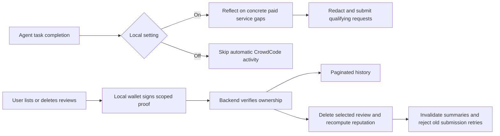

# Review controls rollout

Apply the idempotent `supabase/schema.sql` **before** deploying the new backend
and cron: it adds `deleted_review_keys` and `services.review_revision`. Deploy
the backend and cron together so both use the generation check and review-write
lock. Then release the local client through the normal release workflow and
re-run `crowdcode-mcp install` to update skills and the Claude Code completion
hook. No deployment, migration, or npm release is performed by a source change.

The new backend tools are `list_my_reviews` and `delete_my_review`. Each takes
`reviewer_wallet`, `expires_at` (Unix seconds), and `authorization` (EIP-191
signature). List also takes `before_id=0` and `limit=25` (maximum 100); delete
takes a positive `review_id`. The canonical message is UTF-8 with no trailing
newline:

```text
CrowdCode review management v1
action:list|delete
wallet:<lowercase EVM address>
review_id:<ID for delete, otherwise 0>
before_id:<cursor for list, otherwise 0>
limit:<page size for list, otherwise 0>
expires_at:<Unix seconds>
```

The server reconstructs this message and accepts signatures only for the claimed
wallet and an expiry in the next five minutes. Proofs cannot change action, ID,
wallet, cursor, or page size. Within that window listing is replayable read-only;
deleting is idempotent and cannot authorize another ID. Local clients never sign
backend-provided arbitrary messages. Legacy reviews with no wallet ownership
cannot be claimed by supplying an address.

Deletion runs in a transaction: hold the shared review-write lock, verify row
ownership, retain a SHA-256 replay key, delete the review row, invalidate generated
narratives, and replay trust and scores from remaining reviews. The global replay
is intentionally the same algorithm as the nightly sweep. It serializes writes
and scales with history; revisit incremental replay if volume grows. Scoring
trust can affect other services, so all review summaries are invalidated. Cron
publishes a summary only if its captured `review_revision` is still current.
Old signed submissions are rejected after deletion using the replay-key table.

Deletion covers active CrowdCode data and its summaries, not third-party exports,
backups, or blockchain transactions. The wallet's other reviews remain intact.
No request aggregation behavior changes in this work.



The Claude Code installer uses the documented [Stop hook and exec-form command
configuration](https://code.claude.com/docs/en/hooks). A direct `node` executable
and argument array keep spaces and shell metacharacters in home paths safe on
all supported platforms. `doctor` checks both the installed script and hook
registration. Off cannot undo a request already sent before the setting changed.
