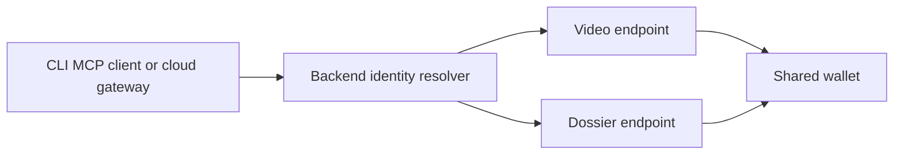

# Service identity and shared payment wallets

A service is identified by its registered endpoint, service ID, or directory
slug. Payment destinations are associations with that service, not globally
unique product identifiers. Multiple endpoints can share a payee and retain
independent reviews, scores, and service IDs.

When an endpoint is supplied, payment-target lookup cannot select a different
service. A new endpoint remains unresolved until its first signed, verified
review registers it. Existing service identities still reject unregistered
endpoint aliases and payment destinations. Wallet-only lookup succeeds only
when exactly one service matches; otherwise the caller must supply the endpoint
or service ID. Machine-payment aliases remain case-insensitive and can span
x402/Base and mppx/Tempo for the same registered EVM payee.

Registration takes a transaction advisory lock and re-resolves the endpoint to
avoid duplicate services during concurrent first reviews. A transfer proves
payment to the wallet; it does not independently attest which URL was served.
The review signature binds the asserted URL to the reviewer, as before.

## Rollout

1. Deploy backend 0.5.2 or newer. Its inserts work under either schema, and
   wallet lookups include canonical service payees to cover old omitted aliases.
2. Apply `supabase/shared-payment-wallets.sql` in one transaction. Product
   identifiers stay globally unique; payment destinations become unique per
   service. Canonical payment associations are backfilled idempotently. No
   service IDs, reviews, or scores are merged or deleted.
3. Verify an existing endpoint still resolves, two endpoints can share one
   payee, and a wallet-only lookup of that shared payee reports ambiguity.
4. Retry pending reviews using their original settled receipts. Do not purchase
   the service again just to retry its review.

Do not roll back to a backend older than 0.5.2 after applying the schema change:
older code assumes one globally unique payment identifier and uses its old
conflict target. Roll forward with a compatible backend if needed.

## Verification

`TEST_DATABASE_URL=postgresql://... python -m pytest -q` includes real PostgreSQL
schema/backfill, concurrent-registration, and signed-review regressions. Tests
create and remove isolated schemas; they never use `DATABASE_URL` as the test
connection. CI runs these against its dedicated PostgreSQL service.
